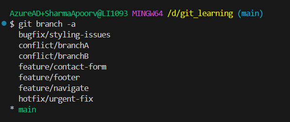

# Git Branching Strategy

This document outlines the team's branching strategy for effective collaboration, version control, and release management.

---

## When to Create Branches

- **Feature Branches**
  - Created for new features or enhancements.
  - Use when work will take more than a few minutes or needs code review.
  - Branch from: `develop`

- **Hotfix Branches**
  - Created for critical production issues that need immediate fixing.
  - Branch from: `main`
  - Merged back into: `main` and `develop`

- **Release Branches**
  - Created when preparing for a production release.
  - Used for final testing, documentation, and minor bug fixes.
  - Branch from: `develop`
  - Merged into: `main` and `develop`

---

## Naming Conventions

- `feature/<short-description>`  
  _e.g._ `feature/login-form`, `feature/payment-api`

- `bugfix/<short-description>`  
  _e.g._ `bugfix/crash-on-login`

- `hotfix/<short-description>`  
  _e.g._ `hotfix/broken-header`

- `release/<version>`  
  _e.g._ `release/1.2.0`

---

## Merge Strategies

- **Feature and Bugfix branches**
  - Use **no fast-forward** merges (`--no-ff`) to preserve history.
  - Optionally use **squash** if commits are messy.

- **Release branches**
  - Use **no fast-forward** for clear release boundaries.

- **Hotfix branches**
  - Use **fast-forward** when possible for simplicity.

- **Rebase**
  - Use interactively (on local branches) to clean up commit history before merging.
  - Never rebase shared/public branches.

---

## Branch Flow Diagram

