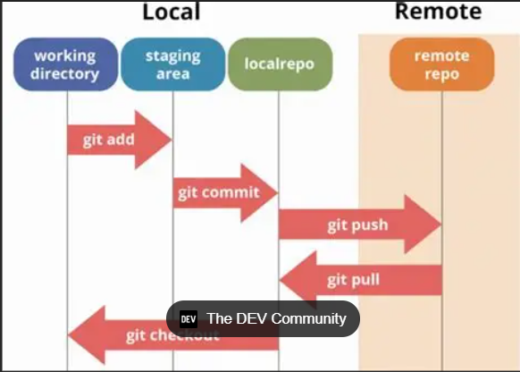
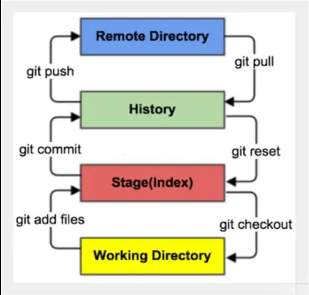

# Understanding Git: Core Concepts Explained

Git is a distributed version control system that empowers developers to track changes, collaborate efficiently, and manage code history across time. Here’s a comprehensive 500-word primer on Git's foundational concepts.

## 🧠 What Is Git?

Git is not just a tool—it’s a mindset for managing changes. Unlike centralized systems, Git enables each developer to have a full local copy of the repository, including its entire history. This decentralization improves reliability and speeds up development workflows.

## 📂 Repository (Repo)

A Git repository is a container for your project. It holds all tracked files, commit history, branches, and configuration. Repositories can be local (on your machine) or remote (hosted on platforms like GitHub or GitLab). Initiating a repo starts with `git init`.

## 🔄 Version Control & Commits

Git tracks changes through **commits**—snapshots of your code at specific points in time. Each commit contains a message, timestamp, and a unique hash. Commits are created by staging changes (`git add`) and saving them (`git commit`). This chronological record allows developers to revisit, analyze, or undo specific changes.

## 🌳 Branches

A **branch** is a parallel line of development. The default branch is typically `main`, and other branches like `feature/login` or `bugfix/header-overlap` let you work independently. Git encourages creating branches for specific tasks to isolate changes and prevent disrupting stable code.

## 🔁 Merging & Conflict Resolution

Branches eventually merge back into the main line. Merging combines the changes from two branches. If changes affect the same lines of code, Git raises a **merge conflict**—which requires manual resolution. Conflicts are resolved by editing the affected files, staging the fixes, and committing the resolution.

## ⏪ Undoing Changes

Git provides several ways to undo mistakes:
- `git revert` creates a new commit that negates a previous one.
- `git reset` moves the branch pointer and optionally removes commits or staged changes.
- `git checkout` can restore a file from a previous commit.
- `git reflog` allows recovery of lost commits and branch movements.

## 📡 Remote Collaboration

Remote repositories enable teams to collaborate. Using `git push`, you send your local changes to the remote. With `git pull`, you bring in others’ changes. Git also supports forking, cloning, and pull requests—all vital for open-source contribution and team development.

## 🕵️‍♂️ Git History & Inspection

Commands like `git log`, `git diff`, `git status`, and `git blame` allow users to inspect commit history, view changes, and analyze authorship. These tools support auditing and troubleshooting.

## 📜 Gitignore & Repository Hygiene

The `.gitignore` file excludes unnecessary or sensitive files from version control—like `node_modules/`, `.env`, or log files. Maintaining clean repos prevents clutter and potential data leaks.

## 💡 Best Practices

- Use meaningful commit messages.
- Work on branches—not directly on `main`.
- Review and test before merging.
- Pull frequently to avoid conflicts.
- Document your workflow and commands.

Git is much more than a tool—it’s a pillar of collaborative software development. Understanding and mastering these concepts elevates code quality, team efficiency, and long-term project maintainability.

## Workflow diagram 

